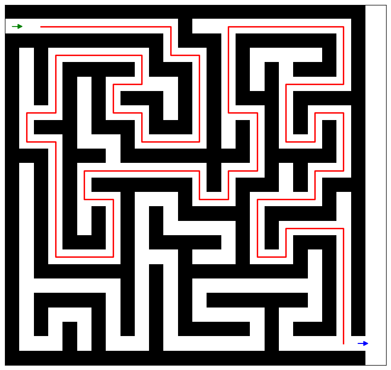

# Maze Solver
A Python program to generate and solve mazes using BFS algorithm.

## Usage
- Clone the repository.
- Run `python maze_solver.py`.
- Follow prompts to set maze dimensions.

## Example

